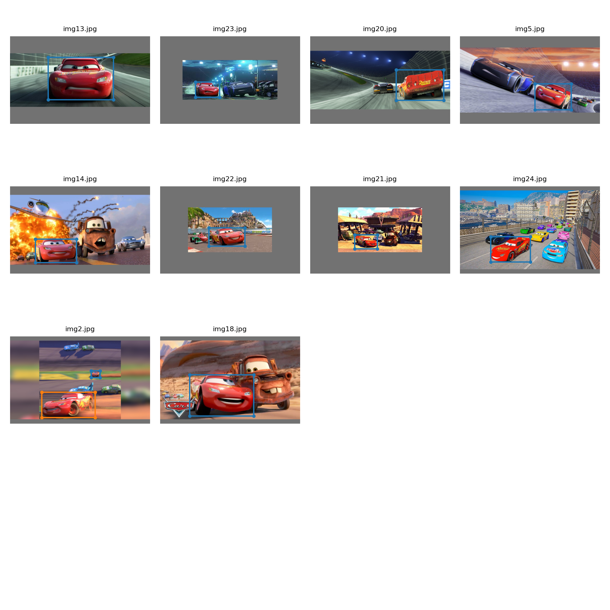

# Training YOLO v3
Trained Yolo v3 using images of Disney character Lightning McQueen. I have annotated the images using Yolo v3 tool and trained the model for 100 epochs

## Training Logs
```
Namespace(epochs=100, batch_size=10, accumulate=4, cfg='cfg/yolov3-custom.cfg', data='data/custom/custom.data', multi_scale=False, img_size=[512], rect=False, resume=False, nosave=True, notest=False, evolve=False, bucket='', cache_images=True, weights='weights/yolov3-spp-ultralytics.pt', name='', device='', adam=False, single_cls=False)
Using CUDA device0 _CudaDeviceProperties(name='Tesla P100-PCIE-16GB', total_memory=16276MB)

2024-04-22 10:43:08.088296: E external/local_xla/xla/stream_executor/cuda/cuda_dnn.cc:9261] Unable to register cuDNN factory: Attempting to register factory for plugin cuDNN when one has already been registered
2024-04-22 10:43:08.088358: E external/local_xla/xla/stream_executor/cuda/cuda_fft.cc:607] Unable to register cuFFT factory: Attempting to register factory for plugin cuFFT when one has already been registered
2024-04-22 10:43:08.089859: E external/local_xla/xla/stream_executor/cuda/cuda_blas.cc:1515] Unable to register cuBLAS factory: Attempting to register factory for plugin cuBLAS when one has already been registered
Run 'tensorboard --logdir=runs' to view tensorboard at http://localhost:6006/
WARNING: smart bias initialization failure.
WARNING: smart bias initialization failure.
WARNING: smart bias initialization failure.
Model Summary: 225 layers, 6.25733e+07 parameters, 6.25733e+07 gradients
Caching labels (22 found, 0 missing, 0 empty, 0 duplicate, for 22 images): 100%|
Caching images (0.0GB): 100%|██████████████████| 22/22 [00:00<00:00, 132.46it/s]
Caching labels (22 found, 0 missing, 0 empty, 0 duplicate, for 22 images): 100%|
Caching images (0.0GB): 100%|███████████████████| 22/22 [00:00<00:00, 79.28it/s]
Image sizes 512 - 512 train, 512 test
Using 4 dataloader workers
Starting training for 100 epochs...

     Epoch   gpu_mem      GIoU       obj       cls     total   targets  img_size
  0%|                                                     | 0/3 [00:00<?, ?it/s]/kaggle/working/common/utils/utils.py:374: UserWarning: The torch.cuda.*DtypeTensor constructors are no longer recommended. It's best to use methods such as torch.tensor(data, dtype=*, device='cuda') to create tensors. (Triggered internally at /usr/local/src/pytorch/torch/csrc/tensor/python_tensor.cpp:83.)
  lcls, lbox, lobj = ft([0]), ft([0]), ft([0])
/opt/conda/lib/python3.10/site-packages/torch/cuda/memory.py:444: FutureWarning: torch.cuda.memory_cached has been renamed to torch.cuda.memory_reserved
  warnings.warn(
      0/99     9.21G      7.72       136         0       144         3       512
/opt/conda/lib/python3.10/site-packages/torch/functional.py:504: UserWarning: torch.meshgrid: in an upcoming release, it will be required to pass the indexing argument. (Triggered internally at /usr/local/src/pytorch/aten/src/ATen/native/TensorShape.cpp:3526.)
  return _VF.meshgrid(tensors, **kwargs)  # type: ignore[attr-defined]
               Class    Images   Targets         P         R   mAP@0.5        F1
                 all        22        23  0.000157      0.87   0.00249  0.000314

     Epoch   gpu_mem      GIoU       obj       cls     total   targets  img_size
      1/99     9.21G      5.36      94.1         0      99.4         4       512
               Class    Images   Targets         P         R   mAP@0.5        F1
                 all        22        23  0.000705     0.739   0.00149   0.00141

     Epoch   gpu_mem      GIoU       obj       cls     total   targets  img_size
      2/99     9.21G      4.68      34.3         0        39         3       512
               Class    Images   Targets         P         R   mAP@0.5        F1
                 all        22        23         0         0   0.00176         0

     Epoch   gpu_mem      GIoU       obj       cls     total   targets  img_size
      3/99     9.21G      5.35      10.5         0      15.9         3       512
               Class    Images   Targets         P         R   mAP@0.5        F1
                 all        22        23         0         0   0.00176         0

     Epoch   gpu_mem      GIoU       obj       cls     total   targets  img_size
      4/99     9.21G      4.95      6.77         0      11.7         5       512
               Class    Images   Targets         P         R   mAP@0.5        F1
                 all        22        23         0         0   0.00237         0

     Epoch   gpu_mem      GIoU       obj       cls     total   targets  img_size
      5/99     9.21G      4.38       4.1         0      8.48         6       512
               Class    Images   Targets         P         R   mAP@0.5        F1
                 all        22        23         0         0   0.00387         0

     Epoch   gpu_mem      GIoU       obj       cls     total   targets  img_size
      6/99     9.21G      4.31      3.03         0      7.34         5       512
               Class    Images   Targets         P         R   mAP@0.5        F1
                 all        22        23         0         0    0.0131         0

     Epoch   gpu_mem      GIoU       obj       cls     total   targets  img_size
      7/99     9.21G      4.08      2.66         0      6.74         4       512
               Class    Images   Targets         P         R   mAP@0.5        F1
                 all        22        23         0         0    0.0131         0

     Epoch   gpu_mem      GIoU       obj       cls     total   targets  img_size
      8/99     9.21G      3.15      2.16         0      5.31         3       512
               Class    Images   Targets         P         R   mAP@0.5        F1
                 all        22        23         0         0    0.0129         0

     Epoch   gpu_mem      GIoU       obj       cls     total   targets  img_size
      9/99     9.21G      3.55      2.91         0      6.46         5       512
               Class    Images   Targets         P         R   mAP@0.5        F1
                 all        22        23         0         0    0.0279         0

     Epoch   gpu_mem      GIoU       obj       cls     total   targets  img_size
     10/99     9.21G      4.06      2.54         0      6.61         4       512
               Class    Images   Targets         P         R   mAP@0.5        F1
                 all        22        23         0         0     0.051         0

     Epoch   gpu_mem      GIoU       obj       cls     total   targets  img_size
     11/99     9.21G      4.67      2.03         0       6.7         3       512
               Class    Images   Targets         P         R   mAP@0.5        F1
                 all        22        23         0         0     0.051         0

     Epoch   gpu_mem      GIoU       obj       cls     total   targets  img_size
     12/99     9.21G      4.08      2.37         0      6.45         4       512
               Class    Images   Targets         P         R   mAP@0.5        F1
                 all        22        23         0         0     0.167         0

     Epoch   gpu_mem      GIoU       obj       cls     total   targets  img_size
     13/99     9.21G      5.14      2.57         0       7.7         5       512
               Class    Images   Targets         P         R   mAP@0.5        F1
                 all        22        23         0         0     0.389         0

     Epoch   gpu_mem      GIoU       obj       cls     total   targets  img_size
     14/99     9.21G      4.41      2.18         0      6.59         3       512
               Class    Images   Targets         P         R   mAP@0.5        F1
                 all        22        23         1    0.0435     0.522    0.0833

     Epoch   gpu_mem      GIoU       obj       cls     total   targets  img_size
     15/99     9.21G      3.92      2.95         0      6.87         5       512
               Class    Images   Targets         P         R   mAP@0.5        F1
                 all        22        23         1    0.0435     0.522    0.0833

     Epoch   gpu_mem      GIoU       obj       cls     total   targets  img_size
     16/99     9.21G      4.57      2.08         0      6.65         4       512
               Class    Images   Targets         P         R   mAP@0.5        F1
                 all        22        23         1    0.0435     0.563    0.0833

     Epoch   gpu_mem      GIoU       obj       cls     total   targets  img_size
     17/99     9.21G      3.51      2.22         0      5.73         3       512
               Class    Images   Targets         P         R   mAP@0.5        F1
                 all        22        23         1    0.0435     0.472    0.0833

     Epoch   gpu_mem      GIoU       obj       cls     total   targets  img_size
     18/99     9.21G      4.02      2.32         0      6.34         2       512
               Class    Images   Targets         P         R   mAP@0.5        F1
                 all        22        23         1    0.0435      0.59    0.0833

     Epoch   gpu_mem      GIoU       obj       cls     total   targets  img_size
     19/99     9.21G      3.31      2.53         0      5.85         4       512
               Class    Images   Targets         P         R   mAP@0.5        F1
                 all        22        23         1    0.0435      0.59    0.0833

     Epoch   gpu_mem      GIoU       obj       cls     total   targets  img_size
     20/99     9.21G      3.27      2.22         0      5.49         3       512
               Class    Images   Targets         P         R   mAP@0.5        F1
                 all        22        23         1    0.0435     0.606    0.0833

     Epoch   gpu_mem      GIoU       obj       cls     total   targets  img_size
     21/99     9.21G      4.56       2.2         0      6.75         3       512
               Class    Images   Targets         P         R   mAP@0.5        F1
                 all        22        23     0.642     0.304     0.609     0.413

     Epoch   gpu_mem      GIoU       obj       cls     total   targets  img_size
     22/99     9.21G      3.18      1.88         0      5.06         4       512
               Class    Images   Targets         P         R   mAP@0.5        F1
                 all        22        23     0.483     0.652     0.564     0.555

     Epoch   gpu_mem      GIoU       obj       cls     total   targets  img_size
     23/99     9.21G      2.42       2.2         0      4.62         4       512
               Class    Images   Targets         P         R   mAP@0.5        F1
                 all        22        23     0.483     0.652     0.564     0.555

     Epoch   gpu_mem      GIoU       obj       cls     total   targets  img_size
     24/99     9.21G      4.04      1.73         0      5.77         3       512
               Class    Images   Targets         P         R   mAP@0.5        F1
                 all        22        23     0.297     0.783     0.505      0.43

     Epoch   gpu_mem      GIoU       obj       cls     total   targets  img_size
     25/99     9.21G      3.14      2.67         0      5.81         7       512
               Class    Images   Targets         P         R   mAP@0.5        F1
                 all        22        23      0.27     0.783     0.557     0.401

     Epoch   gpu_mem      GIoU       obj       cls     total   targets  img_size
     26/99     9.21G      3.18      1.56         0      4.74         4       512
               Class    Images   Targets         P         R   mAP@0.5        F1
                 all        22        23     0.152     0.826     0.536     0.257

     Epoch   gpu_mem      GIoU       obj       cls     total   targets  img_size
     27/99     9.21G      3.71      1.44         0      5.15         5       512
               Class    Images   Targets         P         R   mAP@0.5        F1
                 all        22        23     0.152     0.826     0.536     0.257

     Epoch   gpu_mem      GIoU       obj       cls     total   targets  img_size
     28/99     9.21G      4.96      1.46         0      6.43         5       512
               Class    Images   Targets         P         R   mAP@0.5        F1
                 all        22        23    0.0937     0.478      0.11     0.157

     Epoch   gpu_mem      GIoU       obj       cls     total   targets  img_size
     29/99     9.21G      4.41       1.4         0      5.81         4       512
               Class    Images   Targets         P         R   mAP@0.5        F1
                 all        22        23      0.13     0.913     0.278     0.228

     Epoch   gpu_mem      GIoU       obj       cls     total   targets  img_size
     30/99     9.21G      5.76       1.2         0      6.96         3       512
               Class    Images   Targets         P         R   mAP@0.5        F1
                 all        22        23    0.0624     0.391     0.087     0.108

     Epoch   gpu_mem      GIoU       obj       cls     total   targets  img_size
     31/99     9.21G      4.42      1.34         0      5.76         5       512
               Class    Images   Targets         P         R   mAP@0.5        F1
                 all        22        23    0.0624     0.391     0.087     0.108

     Epoch   gpu_mem      GIoU       obj       cls     total   targets  img_size
     32/99     9.21G      3.35      1.19         0      4.54         4       512
               Class    Images   Targets         P         R   mAP@0.5        F1
                 all        22        23     0.173     0.913     0.668     0.291

     Epoch   gpu_mem      GIoU       obj       cls     total   targets  img_size
     33/99     9.21G      3.71      1.24         0      4.95         3       512
               Class    Images   Targets         P         R   mAP@0.5        F1
                 all        22        23    0.0915     0.565     0.122     0.157

     Epoch   gpu_mem      GIoU       obj       cls     total   targets  img_size
     34/99     9.21G      4.23     0.956         0      5.18         4       512
               Class    Images   Targets         P         R   mAP@0.5        F1
                 all        22        23     0.133      0.87     0.423      0.23

     Epoch   gpu_mem      GIoU       obj       cls     total   targets  img_size
     35/99     9.21G       3.5     0.983         0      4.48         3       512
               Class    Images   Targets         P         R   mAP@0.5        F1
                 all        22        23     0.133      0.87     0.423      0.23

     Epoch   gpu_mem      GIoU       obj       cls     total   targets  img_size
     36/99     9.21G      4.21      1.02         0      5.23         4       512
               Class    Images   Targets         P         R   mAP@0.5        F1
                 all        22        23     0.111     0.696     0.149     0.191

     Epoch   gpu_mem      GIoU       obj       cls     total   targets  img_size
     37/99     9.21G      4.13     0.758         0      4.89         4       512
               Class    Images   Targets         P         R   mAP@0.5        F1
                 all        22        23     0.165     0.913     0.568     0.279

     Epoch   gpu_mem      GIoU       obj       cls     total   targets  img_size
     38/99     9.21G      2.83     0.915         0      3.75         4       512
               Class    Images   Targets         P         R   mAP@0.5        F1
                 all        22        23     0.207      0.87     0.626     0.334

     Epoch   gpu_mem      GIoU       obj       cls     total   targets  img_size
     39/99     9.21G      3.18      0.81         0      3.99         4       512
               Class    Images   Targets         P         R   mAP@0.5        F1
                 all        22        23     0.207      0.87     0.626     0.334

     Epoch   gpu_mem      GIoU       obj       cls     total   targets  img_size
     40/99     9.21G      3.51     0.724         0      4.23         4       512
               Class    Images   Targets         P         R   mAP@0.5        F1
                 all        22        23     0.235     0.913     0.745     0.373

     Epoch   gpu_mem      GIoU       obj       cls     total   targets  img_size
     41/99     9.21G      5.57      1.21         0      6.78         6       512
               Class    Images   Targets         P         R   mAP@0.5        F1
                 all        22        23     0.324      0.87     0.696     0.473

     Epoch   gpu_mem      GIoU       obj       cls     total   targets  img_size
     42/99     9.21G       4.5     0.724         0      5.23         6       512
               Class    Images   Targets         P         R   mAP@0.5        F1
                 all        22        23     0.333     0.783      0.68     0.468

     Epoch   gpu_mem      GIoU       obj       cls     total   targets  img_size
     43/99     9.21G       3.5     0.811         0      4.31         6       512
               Class    Images   Targets         P         R   mAP@0.5        F1
                 all        22        23     0.333     0.783      0.68     0.468

     Epoch   gpu_mem      GIoU       obj       cls     total   targets  img_size
     44/99     9.21G      3.28     0.718         0         4         4       512
               Class    Images   Targets         P         R   mAP@0.5        F1
                 all        22        23      0.52     0.826     0.705     0.639

     Epoch   gpu_mem      GIoU       obj       cls     total   targets  img_size
     45/99     9.21G      3.65      0.95         0       4.6         4       512
               Class    Images   Targets         P         R   mAP@0.5        F1
                 all        22        23     0.439     0.826     0.728     0.573

     Epoch   gpu_mem      GIoU       obj       cls     total   targets  img_size
     46/99     9.21G       2.5     0.648         0      3.15         3       512
               Class    Images   Targets         P         R   mAP@0.5        F1
                 all        22        23     0.547      0.87     0.849     0.671

     Epoch   gpu_mem      GIoU       obj       cls     total   targets  img_size
     47/99     9.21G      2.75     0.639         0      3.39         4       512
               Class    Images   Targets         P         R   mAP@0.5        F1
                 all        22        23     0.547      0.87     0.849     0.671

     Epoch   gpu_mem      GIoU       obj       cls     total   targets  img_size
     48/99     9.21G      2.55     0.706         0      3.25         3       512
               Class    Images   Targets         P         R   mAP@0.5        F1
                 all        22        23      0.45     0.913     0.869     0.603

     Epoch   gpu_mem      GIoU       obj       cls     total   targets  img_size
     49/99     9.21G      3.46     0.591         0      4.05         4       512
               Class    Images   Targets         P         R   mAP@0.5        F1
                 all        22        23     0.462     0.913     0.891     0.614

     Epoch   gpu_mem      GIoU       obj       cls     total   targets  img_size
     50/99     9.21G      3.74      0.53         0      4.27         2       512
               Class    Images   Targets         P         R   mAP@0.5        F1
                 all        22        23     0.381     0.913      0.85     0.538

     Epoch   gpu_mem      GIoU       obj       cls     total   targets  img_size
     51/99     9.21G      2.94     0.531         0      3.47         3       512
               Class    Images   Targets         P         R   mAP@0.5        F1
                 all        22        23     0.381     0.913      0.85     0.538

     Epoch   gpu_mem      GIoU       obj       cls     total   targets  img_size
     52/99     9.21G      3.46     0.959         0      4.42         7       512
               Class    Images   Targets         P         R   mAP@0.5        F1
                 all        22        23     0.494     0.913     0.895     0.641

     Epoch   gpu_mem      GIoU       obj       cls     total   targets  img_size
     53/99     9.21G      3.84     0.648         0      4.49         4       512
               Class    Images   Targets         P         R   mAP@0.5        F1
                 all        22        23     0.573     0.913     0.883     0.704

     Epoch   gpu_mem      GIoU       obj       cls     total   targets  img_size
     54/99     9.21G      2.69     0.399         0      3.09         2       512
               Class    Images   Targets         P         R   mAP@0.5        F1
                 all        22        23     0.481     0.913     0.892      0.63

     Epoch   gpu_mem      GIoU       obj       cls     total   targets  img_size
     55/99     9.21G      3.39     0.435         0      3.83         3       512
               Class    Images   Targets         P         R   mAP@0.5        F1
                 all        22        23     0.481     0.913     0.892      0.63

     Epoch   gpu_mem      GIoU       obj       cls     total   targets  img_size
     56/99     9.21G       4.5     0.533         0      5.03         4       512
               Class    Images   Targets         P         R   mAP@0.5        F1
                 all        22        23     0.698     0.913     0.913     0.791

     Epoch   gpu_mem      GIoU       obj       cls     total   targets  img_size
     57/99     9.21G      3.55     0.539         0      4.09         4       512
               Class    Images   Targets         P         R   mAP@0.5        F1
                 all        22        23     0.864     0.913     0.932     0.888

     Epoch   gpu_mem      GIoU       obj       cls     total   targets  img_size
     58/99     9.21G      3.09     0.674         0      3.77         5       512
               Class    Images   Targets         P         R   mAP@0.5        F1
                 all        22        23     0.843     0.913     0.938     0.877

     Epoch   gpu_mem      GIoU       obj       cls     total   targets  img_size
     59/99     9.21G       3.6      0.63         0      4.23         6       512
               Class    Images   Targets         P         R   mAP@0.5        F1
                 all        22        23     0.843     0.913     0.938     0.877

     Epoch   gpu_mem      GIoU       obj       cls     total   targets  img_size
     60/99     9.21G      2.54     0.558         0       3.1         4       512
               Class    Images   Targets         P         R   mAP@0.5        F1
                 all        22        23     0.849     0.913     0.938      0.88

     Epoch   gpu_mem      GIoU       obj       cls     total   targets  img_size
     61/99     9.21G      2.97     0.513         0      3.48         4       512
               Class    Images   Targets         P         R   mAP@0.5        F1
                 all        22        23     0.841     0.913     0.946     0.875

     Epoch   gpu_mem      GIoU       obj       cls     total   targets  img_size
     62/99     9.21G      1.55     0.554         0       2.1         3       512
               Class    Images   Targets         P         R   mAP@0.5        F1
                 all        22        23     0.721     0.913     0.947     0.806

     Epoch   gpu_mem      GIoU       obj       cls     total   targets  img_size
     63/99     9.21G      2.88     0.448         0      3.33         4       512
               Class    Images   Targets         P         R   mAP@0.5        F1
                 all        22        23     0.721     0.913     0.947     0.806

     Epoch   gpu_mem      GIoU       obj       cls     total   targets  img_size
     64/99     9.21G      2.24     0.421         0      2.66         3       512
               Class    Images   Targets         P         R   mAP@0.5        F1
                 all        22        23     0.805     0.913      0.95     0.856

     Epoch   gpu_mem      GIoU       obj       cls     total   targets  img_size
     65/99     9.21G         3      0.57         0      3.57         5       512
               Class    Images   Targets         P         R   mAP@0.5        F1
                 all        22        23     0.543     0.913     0.899     0.681

     Epoch   gpu_mem      GIoU       obj       cls     total   targets  img_size
     66/99     9.21G      2.48       0.4         0      2.88         4       512
               Class    Images   Targets         P         R   mAP@0.5        F1
                 all        22        23     0.691     0.913     0.942     0.787

     Epoch   gpu_mem      GIoU       obj       cls     total   targets  img_size
     67/99     9.21G      2.33     0.543         0      2.88         3       512
               Class    Images   Targets         P         R   mAP@0.5        F1
                 all        22        23     0.691     0.913     0.942     0.787

     Epoch   gpu_mem      GIoU       obj       cls     total   targets  img_size
     68/99     9.21G      2.08     0.346         0      2.43         3       512
               Class    Images   Targets         P         R   mAP@0.5        F1
                 all        22        23     0.483     0.913     0.895     0.632

     Epoch   gpu_mem      GIoU       obj       cls     total   targets  img_size
     69/99     9.21G      2.74     0.639         0      3.38         4       512
               Class    Images   Targets         P         R   mAP@0.5        F1
                 all        22        23     0.628     0.913     0.945     0.744

     Epoch   gpu_mem      GIoU       obj       cls     total   targets  img_size
     70/99     9.21G      2.05     0.368         0      2.42         3       512
               Class    Images   Targets         P         R   mAP@0.5        F1
                 all        22        23      0.51     0.913     0.919     0.655

     Epoch   gpu_mem      GIoU       obj       cls     total   targets  img_size
     71/99     9.21G      3.04     0.474         0      3.52         3       512
               Class    Images   Targets         P         R   mAP@0.5        F1
                 all        22        23      0.51     0.913     0.919     0.655

     Epoch   gpu_mem      GIoU       obj       cls     total   targets  img_size
     72/99     9.21G      3.35     0.381         0      3.73         6       512
               Class    Images   Targets         P         R   mAP@0.5        F1
                 all        22        23     0.621     0.926     0.945     0.744

     Epoch   gpu_mem      GIoU       obj       cls     total   targets  img_size
     73/99     9.21G      2.44     0.543         0      2.98         4       512
               Class    Images   Targets         P         R   mAP@0.5        F1
                 all        22        23     0.608     0.913     0.944      0.73

     Epoch   gpu_mem      GIoU       obj       cls     total   targets  img_size
     74/99     9.21G      2.47     0.476         0      2.94         4       512
               Class    Images   Targets         P         R   mAP@0.5        F1
                 all        22        23     0.717     0.913     0.951     0.803

     Epoch   gpu_mem      GIoU       obj       cls     total   targets  img_size
     75/99     9.21G      2.85     0.405         0      3.25         3       512
               Class    Images   Targets         P         R   mAP@0.5        F1
                 all        22        23     0.717     0.913     0.951     0.803

     Epoch   gpu_mem      GIoU       obj       cls     total   targets  img_size
     76/99     9.21G       2.4     0.396         0       2.8         3       512
               Class    Images   Targets         P         R   mAP@0.5        F1
                 all        22        23     0.723     0.913     0.953     0.807

     Epoch   gpu_mem      GIoU       obj       cls     total   targets  img_size
     77/99     9.21G      1.47     0.455         0      1.92         3       512
               Class    Images   Targets         P         R   mAP@0.5        F1
                 all        22        23     0.789     0.913     0.958     0.846

     Epoch   gpu_mem      GIoU       obj       cls     total   targets  img_size
     78/99     9.21G      2.32     0.306         0      2.62         3       512
               Class    Images   Targets         P         R   mAP@0.5        F1
                 all        22        23     0.791     0.913     0.956     0.848

     Epoch   gpu_mem      GIoU       obj       cls     total   targets  img_size
     79/99     9.21G      2.86     0.421         0      3.28         4       512
               Class    Images   Targets         P         R   mAP@0.5        F1
                 all        22        23     0.791     0.913     0.956     0.848

     Epoch   gpu_mem      GIoU       obj       cls     total   targets  img_size
     80/99     9.21G      3.41     0.679         0      4.09         5       512
               Class    Images   Targets         P         R   mAP@0.5        F1
                 all        22        23     0.804     0.913     0.957     0.855

     Epoch   gpu_mem      GIoU       obj       cls     total   targets  img_size
     81/99     9.21G      2.63     0.375         0         3         4       512
               Class    Images   Targets         P         R   mAP@0.5        F1
                 all        22        23     0.829     0.913      0.96     0.869

     Epoch   gpu_mem      GIoU       obj       cls     total   targets  img_size
     82/99     9.21G      1.84     0.356         0       2.2         4       512
               Class    Images   Targets         P         R   mAP@0.5        F1
                 all        22        23     0.802     0.913     0.959     0.854

     Epoch   gpu_mem      GIoU       obj       cls     total   targets  img_size
     83/99     9.21G      1.98     0.347         0      2.33         4       512
               Class    Images   Targets         P         R   mAP@0.5        F1
                 all        22        23     0.802     0.913     0.959     0.854

     Epoch   gpu_mem      GIoU       obj       cls     total   targets  img_size
     84/99     9.21G      3.32     0.493         0      3.82         6       512
               Class    Images   Targets         P         R   mAP@0.5        F1
                 all        22        23     0.833     0.913     0.964     0.871

     Epoch   gpu_mem      GIoU       obj       cls     total   targets  img_size
     85/99     9.21G       2.5     0.449         0      2.95         3       512
               Class    Images   Targets         P         R   mAP@0.5        F1
                 all        22        23     0.855     0.913     0.964     0.883

     Epoch   gpu_mem      GIoU       obj       cls     total   targets  img_size
     86/99     9.21G      1.71     0.451         0      2.16         4       512
               Class    Images   Targets         P         R   mAP@0.5        F1
                 all        22        23      0.79     0.913     0.965     0.847

     Epoch   gpu_mem      GIoU       obj       cls     total   targets  img_size
     87/99     9.21G      1.57     0.377         0      1.94         4       512
               Class    Images   Targets         P         R   mAP@0.5        F1
                 all        22        23      0.79     0.913     0.965     0.847

     Epoch   gpu_mem      GIoU       obj       cls     total   targets  img_size
     88/99     9.21G       2.5     0.446         0      2.95         4       512
               Class    Images   Targets         P         R   mAP@0.5        F1
                 all        22        23     0.851     0.913     0.969     0.881

     Epoch   gpu_mem      GIoU       obj       cls     total   targets  img_size
     89/99     9.21G      1.44     0.378         0      1.82         3       512
               Class    Images   Targets         P         R   mAP@0.5        F1
                 all        22        23     0.842     0.913     0.965     0.876

     Epoch   gpu_mem      GIoU       obj       cls     total   targets  img_size
     90/99     9.22G      1.77      0.38         0      2.15         3       512
               Class    Images   Targets         P         R   mAP@0.5        F1
                 all        22        23     0.846     0.913     0.966     0.878

     Epoch   gpu_mem      GIoU       obj       cls     total   targets  img_size
     91/99     9.22G      2.76     0.462         0      3.22         7       512
               Class    Images   Targets         P         R   mAP@0.5        F1
                 all        22        23     0.846     0.913     0.966     0.878

     Epoch   gpu_mem      GIoU       obj       cls     total   targets  img_size
     92/99     9.22G       2.4     0.478         0      2.88         4       512
               Class    Images   Targets         P         R   mAP@0.5        F1
                 all        22        23     0.885     0.913     0.967     0.899

     Epoch   gpu_mem      GIoU       obj       cls     total   targets  img_size
     93/99     9.22G      1.14     0.252         0       1.4         3       512
               Class    Images   Targets         P         R   mAP@0.5        F1
                 all        22        23     0.848     0.913     0.965     0.879

     Epoch   gpu_mem      GIoU       obj       cls     total   targets  img_size
     94/99     9.22G      1.34     0.373         0      1.71         5       512
               Class    Images   Targets         P         R   mAP@0.5        F1
                 all        22        23     0.876     0.913     0.966     0.894

     Epoch   gpu_mem      GIoU       obj       cls     total   targets  img_size
     95/99     9.22G      1.74     0.424         0      2.17         4       512
               Class    Images   Targets         P         R   mAP@0.5        F1
                 all        22        23     0.876     0.913     0.966     0.894

     Epoch   gpu_mem      GIoU       obj       cls     total   targets  img_size
     96/99     9.22G         2     0.467         0      2.46         3       512
               Class    Images   Targets         P         R   mAP@0.5        F1
                 all        22        23     0.873     0.913     0.965     0.892

     Epoch   gpu_mem      GIoU       obj       cls     total   targets  img_size
     97/99     9.22G      1.97     0.408         0      2.38         3       512
               Class    Images   Targets         P         R   mAP@0.5        F1
                 all        22        23     0.866     0.913     0.965     0.889

     Epoch   gpu_mem      GIoU       obj       cls     total   targets  img_size
     98/99     9.22G      1.51     0.307         0      1.82         3       512
               Class    Images   Targets         P         R   mAP@0.5        F1
                 all        22        23     0.869     0.913     0.965      0.89

     Epoch   gpu_mem      GIoU       obj       cls     total   targets  img_size
     99/99     9.22G      1.35     0.291         0      1.64         2       512
               Class    Images   Targets         P         R   mAP@0.5        F1
                 all        22        23     0.869     0.913     0.965      0.89
100 epochs completed in 0.055 hours.
```
## Result

