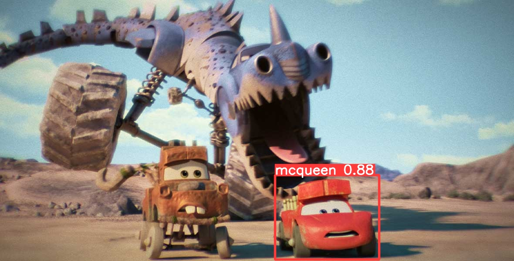

# Assignment 15

### Training Yolo v9 on Cloud

This repo contains the training script for training yolo v9 with custom dataset on the cloud (vast.ai, as aws spot intances didn't work)

Trained on A5000 with Lightning mcqueen dataset which I have uploaded on roboflow

## Dataset
- https://universe.roboflow.com/kgup/mcqueen-f4nrv

## Gradio App
- https://huggingface.co/spaces/kg7/mcqueen_detector




## Training Log
```
train_dual: weights=/yolov9/weights/yolov9-c.pt, cfg=models/detect/yolov9-c.yaml, data=/yolov9/Mcqueen-1/data.yaml, hyp=hyp.scratch-high.yaml, epochs=25, batch_size=16, imgsz=640, rect=False, resume=False, nosave=False, noval=False, noautoanchor=False, noplots=False, evolve=None, bucket=, cache=None, image_weights=False, device=0, multi_scale=False, single_cls=False, optimizer=SGD, sync_bn=False, workers=8, project=runs/train, name=exp, exist_ok=False, quad=False, cos_lr=False, flat_cos_lr=False, fixed_lr=False, label_smoothing=0.0, patience=100, freeze=[0], save_period=-1, seed=0, local_rank=-1, min_items=0, close_mosaic=15, entity=None, upload_dataset=False, bbox_interval=-1, artifact_alias=latest
YOLO 🚀 v0.1-89-g93f1a28 Python-3.10.13 torch-2.2.0 CUDA:0 (NVIDIA RTX A5000, 22721MiB)

hyperparameters: lr0=0.01, lrf=0.01, momentum=0.937, weight_decay=0.0005, warmup_epochs=3.0, warmup_momentum=0.8, warmup_bias_lr=0.1, box=7.5, cls=0.5, cls_pw=1.0, obj=0.7, obj_pw=1.0, dfl=1.5, iou_t=0.2, anchor_t=5.0, fl_gamma=0.0, hsv_h=0.015, hsv_s=0.7, hsv_v=0.4, degrees=0.0, translate=0.1, scale=0.9, shear=0.0, perspective=0.0, flipud=0.0, fliplr=0.5, mosaic=1.0, mixup=0.15, copy_paste=0.3
ClearML: run 'pip install clearml' to automatically track, visualize and remotely train YOLO 🚀 in ClearML
Comet: run 'pip install comet_ml' to automatically track and visualize YOLO 🚀 runs in Comet
TensorBoard: Start with 'tensorboard --logdir runs/train', view at http://localhost:6006/

                 from  n    params  module                                  arguments                     
  0                -1  1         0  models.common.Silence                   []                            
  1                -1  1      1856  models.common.Conv                      [3, 64, 3, 2]                 
  2                -1  1     73984  models.common.Conv                      [64, 128, 3, 2]               
  3                -1  1    212864  models.common.RepNCSPELAN4              [128, 256, 128, 64, 1]        
  4                -1  1    164352  models.common.ADown                     [256, 256]                    
  5                -1  1    847616  models.common.RepNCSPELAN4              [256, 512, 256, 128, 1]       
  6                -1  1    656384  models.common.ADown                     [512, 512]                    
  7                -1  1   2857472  models.common.RepNCSPELAN4              [512, 512, 512, 256, 1]       
  8                -1  1    656384  models.common.ADown                     [512, 512]                    
  9                -1  1   2857472  models.common.RepNCSPELAN4              [512, 512, 512, 256, 1]       
 10                -1  1    656896  models.common.SPPELAN                   [512, 512, 256]               
 11                -1  1         0  torch.nn.modules.upsampling.Upsample    [None, 2, 'nearest']          
 12           [-1, 7]  1         0  models.common.Concat                    [1]                           
 13                -1  1   3119616  models.common.RepNCSPELAN4              [1024, 512, 512, 256, 1]      
 14                -1  1         0  torch.nn.modules.upsampling.Upsample    [None, 2, 'nearest']          
 15           [-1, 5]  1         0  models.common.Concat                    [1]                           
 16                -1  1    912640  models.common.RepNCSPELAN4              [1024, 256, 256, 128, 1]      
 17                -1  1    164352  models.common.ADown                     [256, 256]                    
 18          [-1, 13]  1         0  models.common.Concat                    [1]                           
 19                -1  1   2988544  models.common.RepNCSPELAN4              [768, 512, 512, 256, 1]       
 20                -1  1    656384  models.common.ADown                     [512, 512]                    
 21          [-1, 10]  1         0  models.common.Concat                    [1]                           
 22                -1  1   3119616  models.common.RepNCSPELAN4              [1024, 512, 512, 256, 1]      
 23                 5  1    131328  models.common.CBLinear                  [512, [256]]                  
 24                 7  1    393984  models.common.CBLinear                  [512, [256, 512]]             
 25                 9  1    656640  models.common.CBLinear                  [512, [256, 512, 512]]        
 26                 0  1      1856  models.common.Conv                      [3, 64, 3, 2]                 
 27                -1  1     73984  models.common.Conv                      [64, 128, 3, 2]               
 28                -1  1    212864  models.common.RepNCSPELAN4              [128, 256, 128, 64, 1]        
 29                -1  1    164352  models.common.ADown                     [256, 256]                    
 30  [23, 24, 25, -1]  1         0  models.common.CBFuse                    [[0, 0, 0]]                   
 31                -1  1    847616  models.common.RepNCSPELAN4              [256, 512, 256, 128, 1]       
 32                -1  1    656384  models.common.ADown                     [512, 512]                    
 33      [24, 25, -1]  1         0  models.common.CBFuse                    [[1, 1]]                      
 34                -1  1   2857472  models.common.RepNCSPELAN4              [512, 512, 512, 256, 1]       
 35                -1  1    656384  models.common.ADown                     [512, 512]                    
 36          [25, -1]  1         0  models.common.CBFuse                    [[2]]                         
 37                -1  1   2857472  models.common.RepNCSPELAN4              [512, 512, 512, 256, 1]       
 38[31, 34, 37, 16, 19, 22]  1  21542822  models.yolo.DualDDetect                 [1, [512, 512, 512, 256, 512, 512]]
yolov9-c summary: 962 layers, 50999590 parameters, 50999558 gradients, 238.9 GFLOPs

Transferred 1448/1460 items from /yolov9/weights/yolov9-c.pt
AMP: checks passed ✅
optimizer: SGD(lr=0.01) with parameter groups 238 weight(decay=0.0), 255 weight(decay=0.0005), 253 bias
albumentations: Blur(p=0.01, blur_limit=(3, 7)), MedianBlur(p=0.01, blur_limit=(3, 7)), ToGray(p=0.01), CLAHE(p=0.01, clip_limit=(1, 4.0), tile_grid_size=(8, 8))
train: Scanning /yolov9/Mcqueen-1/train/labels.cache... 54 images, 0 backgrounds
val: Scanning /yolov9/Mcqueen-1/valid/labels.cache... 4 images, 0 backgrounds, 0
Plotting labels to runs/train/exp/labels.jpg... 
Image sizes 640 train, 640 val
Using 8 dataloader workers
Logging results to runs/train/exp
Starting training for 25 epochs...

      Epoch    GPU_mem   box_loss   cls_loss   dfl_loss  Instances       Size
       0/24      19.9G      1.335      3.691      1.832         30        640:  WARNING ⚠️ TensorBoard graph visualization failure Only tensors, lists, tuples of tensors, or dictionary of tensors can be output from traced functions
       0/24        20G      1.545       3.63       1.84         14        640: 1
                 Class     Images  Instances          P          R      mAP50   
                   all          4          4      0.428       0.75      0.398      0.239

      Epoch    GPU_mem   box_loss   cls_loss   dfl_loss  Instances       Size
       1/24        20G      1.614      3.699      1.888         21        640: 1
                 Class     Images  Instances          P          R      mAP50   
                   all          4          4      0.412       0.75       0.41      0.262

      Epoch    GPU_mem   box_loss   cls_loss   dfl_loss  Instances       Size
       2/24        20G       1.49      2.683      1.844         13        640: 1
                 Class     Images  Instances          P          R      mAP50   
                   all          4          4      0.786      0.932      0.945      0.727

      Epoch    GPU_mem   box_loss   cls_loss   dfl_loss  Instances       Size
       3/24        20G      1.524      2.361      1.869         13        640: 1
                 Class     Images  Instances          P          R      mAP50   
                   all          4          4      0.498      0.995      0.497      0.375

      Epoch    GPU_mem   box_loss   cls_loss   dfl_loss  Instances       Size
       4/24        20G      1.237      2.068       1.68         14        640: 1
                 Class     Images  Instances          P          R      mAP50   
                   all          4          4      0.701       0.75      0.782      0.598

      Epoch    GPU_mem   box_loss   cls_loss   dfl_loss  Instances       Size
       5/24        20G      1.172      1.725       1.48         19        640: 1
                 Class     Images  Instances          P          R      mAP50   
                   all          4          4      0.642       0.75      0.849      0.681

      Epoch    GPU_mem   box_loss   cls_loss   dfl_loss  Instances       Size
       6/24        20G      1.124      1.601      1.574          8        640: 1
                 Class     Images  Instances          P          R      mAP50   
                   all          4          4      0.947       0.75       0.87      0.722

      Epoch    GPU_mem   box_loss   cls_loss   dfl_loss  Instances       Size
       7/24      22.3G      1.222      1.491      1.579         12        640: 1
                 Class     Images  Instances          P          R      mAP50   
                   all          4          4      0.702       0.75      0.808      0.627

      Epoch    GPU_mem   box_loss   cls_loss   dfl_loss  Instances       Size
       8/24      22.3G       1.07      1.086      1.451         21        640: 1
                 Class     Images  Instances          P          R      mAP50   
                   all          4          4       0.96       0.75      0.888       0.69

      Epoch    GPU_mem   box_loss   cls_loss   dfl_loss  Instances       Size
       9/24      22.3G      1.104       1.14       1.44         15        640: 1
                 Class     Images  Instances          P          R      mAP50   
                   all          4          4          1       0.73      0.888      0.799
Closing dataloader mosaic

      Epoch    GPU_mem   box_loss   cls_loss   dfl_loss  Instances       Size
      10/24      22.3G     0.7719      1.239      1.328          6        640: 1
                 Class     Images  Instances          P          R      mAP50   
                   all          4          4          1      0.735      0.888      0.726

      Epoch    GPU_mem   box_loss   cls_loss   dfl_loss  Instances       Size
      11/24      22.3G     0.8825      1.123      1.445          8        640: 1
                 Class     Images  Instances          P          R      mAP50   
                   all          4          4       0.43      0.395      0.645      0.483

      Epoch    GPU_mem   box_loss   cls_loss   dfl_loss  Instances       Size
      12/24      22.3G     0.7918      1.216      1.377          6        640: 1
                 Class     Images  Instances          P          R      mAP50   
                   all          4          4      0.649          1      0.828      0.621

      Epoch    GPU_mem   box_loss   cls_loss   dfl_loss  Instances       Size
      13/24      22.3G     0.7774      0.972      1.295          6        640: 1
                 Class     Images  Instances          P          R      mAP50   
                   all          4          4      0.481        0.5      0.357      0.285

      Epoch    GPU_mem   box_loss   cls_loss   dfl_loss  Instances       Size
      14/24      22.3G     0.9631     0.9749      1.393          7        640: 1
                 Class     Images  Instances          P          R      mAP50   
                   all          4          4      0.988        0.5      0.794      0.591

      Epoch    GPU_mem   box_loss   cls_loss   dfl_loss  Instances       Size
      15/24      22.3G     0.8899      1.003      1.318          7        640: 1
                 Class     Images  Instances          P          R      mAP50   
                   all          4          4      0.659          1      0.745      0.633

      Epoch    GPU_mem   box_loss   cls_loss   dfl_loss  Instances       Size
      16/24      22.3G     0.7405     0.7921      1.349          6        640: 1
                 Class     Images  Instances          P          R      mAP50   
                   all          4          4      0.793      0.967      0.945      0.812

      Epoch    GPU_mem   box_loss   cls_loss   dfl_loss  Instances       Size
      17/24      22.3G     0.7851     0.8139      1.322          6        640: 1
                 Class     Images  Instances          P          R      mAP50   
                   all          4          4      0.581       0.75      0.825      0.447

      Epoch    GPU_mem   box_loss   cls_loss   dfl_loss  Instances       Size
      18/24      22.3G     0.8775      0.746      1.354          6        640: 1
                 Class     Images  Instances          P          R      mAP50   
                   all          4          4        0.6       0.75      0.808      0.444

      Epoch    GPU_mem   box_loss   cls_loss   dfl_loss  Instances       Size
      19/24      22.3G      0.851      0.788      1.319          7        640: 1
                 Class     Images  Instances          P          R      mAP50   
                   all          4          4          1      0.749      0.945      0.595

      Epoch    GPU_mem   box_loss   cls_loss   dfl_loss  Instances       Size
      20/24      22.3G     0.8324     0.6592      1.311          6        640: 1
                 Class     Images  Instances          P          R      mAP50   
                   all          4          4          1      0.743      0.945      0.812

      Epoch    GPU_mem   box_loss   cls_loss   dfl_loss  Instances       Size
      21/24      22.3G     0.6987     0.6177      1.287          6        640: 1
                 Class     Images  Instances          P          R      mAP50   
                   all          4          4      0.989       0.75      0.945      0.812

      Epoch    GPU_mem   box_loss   cls_loss   dfl_loss  Instances       Size
      22/24      22.3G     0.7125     0.5726      1.241          6        640: 1
                 Class     Images  Instances          P          R      mAP50   
                   all          4          4      0.984       0.75      0.912      0.783

      Epoch    GPU_mem   box_loss   cls_loss   dfl_loss  Instances       Size
      23/24      22.3G     0.7296     0.5597      1.272          6        640: 1
                 Class     Images  Instances          P          R      mAP50   
                   all          4          4      0.984       0.75      0.912      0.746

      Epoch    GPU_mem   box_loss   cls_loss   dfl_loss  Instances       Size
      24/24      22.3G     0.7265     0.5675      1.222          6        640: 1
                 Class     Images  Instances          P          R      mAP50   
                   all          4          4      0.984       0.75      0.912       0.75

25 epochs completed in 0.042 hours.
Optimizer stripped from runs/train/exp/weights/last.pt, 102.8MB
Optimizer stripped from runs/train/exp/weights/best.pt, 102.8MB

Validating runs/train/exp/weights/best.pt...
Fusing layers... 
yolov9-c summary: 604 layers, 50698278 parameters, 0 gradients, 236.6 GFLOPs
                 Class     Images  Instances          P          R      mAP50   
                   all          4          4      0.989       0.75      0.945      0.812
Results saved to runs/train/exp
```