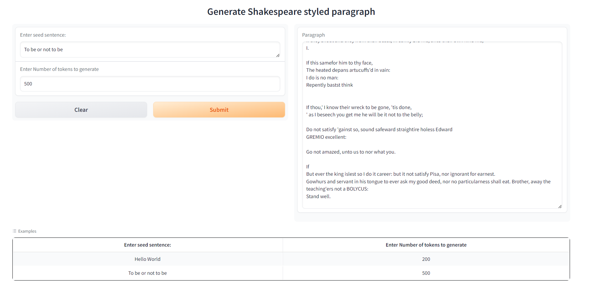
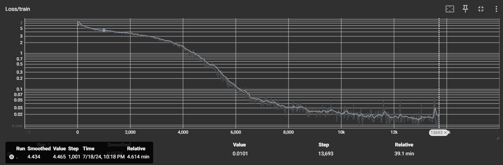

# Assignment 21

## GPT2 - Implemented GPT2 from scratch 
- Created a GPT2 (124M parameters) from scratch with some optimizations and trained on Shakepeare all works dataset. 
- huggingface app: [Shakespeare GPT2](https://huggingface.co/spaces/kg7/ShakespearGPT2)



### Model structure 
```
====================================================================================================
Layer (type:depth-idx)                             Output Shape              Param #
====================================================================================================
├─ModuleDict: 1                                    []                        --
|    └─Embedding: 2-1                              [-1, 768]                 786,432
|    └─Embedding: 2-2                              [-1, 100, 768]            38,633,472
|    └─ModuleList: 2                               []                        --
|    |    └─Block: 3-1                             [-1, 100, 768]            7,087,872
|    |    └─Block: 3-2                             [-1, 100, 768]            7,087,872
|    |    └─Block: 3-3                             [-1, 100, 768]            7,087,872
|    |    └─Block: 3-4                             [-1, 100, 768]            7,087,872
|    |    └─Block: 3-5                             [-1, 100, 768]            7,087,872
|    |    └─Block: 3-6                             [-1, 100, 768]            7,087,872
|    |    └─Block: 3-7                             [-1, 100, 768]            7,087,872
|    |    └─Block: 3-8                             [-1, 100, 768]            7,087,872
|    |    └─Block: 3-9                             [-1, 100, 768]            7,087,872
|    |    └─Block: 3-10                            [-1, 100, 768]            7,087,872
|    |    └─Block: 3-11                            [-1, 100, 768]            7,087,872
|    |    └─Block: 3-12                            [-1, 100, 768]            7,087,872
|    └─LayerNorm: 2-3                              [-1, 100, 768]            1,536
├─Linear: 1-1                                      [-1, 100, 50304]          38,633,472
====================================================================================================
Total params: 163,109,376
Trainable params: 163,109,376
Non-trainable params: 0
Total mult-adds (M): 247.96
====================================================================================================
Input size (MB): 0.00
Forward/backward pass size (MB): 53.62
Params size (MB): 622.21
Estimated Total Size (MB): 675.83
====================================================================================================
```


### Training Logs
```
c:\repos\ERA_V2\S21-Assignment\gpt2.py:65: UserWarning: 1Torch was not compiled with flash attention. (Triggered internally at C:\cb\pytorch_1000000000000\work\aten\src\ATen\native\transformers\cuda\sdp_utils.cpp:455.)
  y = F.scaled_dot_product_attention(q, k, v, is_causal=True)
Step 0, loss: 11.030921936035156, dt: 428.05ms tok/sec: 19137.86
Step 100, loss: 5.84446907043457, dt: 157.00ms tok/sec: 52177.69
Step 200, loss: 5.322109222412109, dt: 166.00ms tok/sec: 49348.23
Step 300, loss: 5.2536139488220215, dt: 161.00ms tok/sec: 50881.98
Step 400, loss: 4.880702018737793, dt: 161.62ms tok/sec: 50685.78
Step 500, loss: 4.45494270324707, dt: 164.12ms tok/sec: 49915.29
Step 600, loss: 4.921161651611328, dt: 162.00ms tok/sec: 50567.99
Step 700, loss: 4.42236852645874, dt: 161.00ms tok/sec: 50882.66
Step 800, loss: 4.441651821136475, dt: 160.00ms tok/sec: 51200.05
Step 900, loss: 4.115748405456543, dt: 161.00ms tok/sec: 50882.28
Step 1000, loss: 4.408835411071777, dt: 161.51ms tok/sec: 50722.59
Step 1100, loss: 4.0244550704956055, dt: 162.00ms tok/sec: 50567.85
Step 1200, loss: 4.29283332824707, dt: 161.12ms tok/sec: 50843.06
Step 1300, loss: 4.194064140319824, dt: 161.00ms tok/sec: 50881.23
Step 1400, loss: 4.005340576171875, dt: 162.51ms tok/sec: 50409.67
Step 1500, loss: 3.9327304363250732, dt: 162.00ms tok/sec: 50567.99
Step 1600, loss: 4.026634216308594, dt: 162.00ms tok/sec: 50567.85
Step 1700, loss: 3.704533100128174, dt: 168.00ms tok/sec: 48761.63
Step 1800, loss: 3.5162887573242188, dt: 162.65ms tok/sec: 50367.11
Step 1900, loss: 3.6213812828063965, dt: 163.65ms tok/sec: 50057.24
Step 2000, loss: 3.567453145980835, dt: 169.13ms tok/sec: 48435.75
Step 2100, loss: 3.4217472076416016, dt: 164.03ms tok/sec: 49940.75
Step 2200, loss: 3.6989176273345947, dt: 171.78ms tok/sec: 47690.26
Step 2300, loss: 3.1883139610290527, dt: 167.74ms tok/sec: 48836.62
Step 2400, loss: 3.4506216049194336, dt: 164.13ms tok/sec: 49912.46
Step 2500, loss: 3.1528217792510986, dt: 168.63ms tok/sec: 48578.94
Step 2600, loss: 3.010504961013794, dt: 165.00ms tok/sec: 49648.35
Step 2700, loss: 2.761927366256714, dt: 161.12ms tok/sec: 50844.56
Step 2800, loss: 2.929175615310669, dt: 161.00ms tok/sec: 50881.91
Step 2900, loss: 2.7659425735473633, dt: 160.01ms tok/sec: 51198.14
Step 3000, loss: 2.6595818996429443, dt: 160.59ms tok/sec: 51011.23
Step 3100, loss: 2.407015085220337, dt: 161.00ms tok/sec: 50882.06
Step 3200, loss: 2.3413479328155518, dt: 160.36ms tok/sec: 51084.19
Step 3300, loss: 2.130338191986084, dt: 161.00ms tok/sec: 50882.06
Step 3400, loss: 1.9854280948638916, dt: 161.00ms tok/sec: 50882.06
Step 3500, loss: 1.8285661935806274, dt: 162.00ms tok/sec: 50568.37
Step 3600, loss: 1.919366717338562, dt: 160.00ms tok/sec: 51200.13
Step 3700, loss: 1.5700737237930298, dt: 161.00ms tok/sec: 50881.76
Step 3800, loss: 1.7983462810516357, dt: 161.00ms tok/sec: 50881.98
Step 3900, loss: 1.4459023475646973, dt: 160.00ms tok/sec: 51199.97
Step 4000, loss: 1.3075239658355713, dt: 160.00ms tok/sec: 51199.90
Step 4100, loss: 1.4234212636947632, dt: 161.00ms tok/sec: 50882.28
Step 4200, loss: 1.0964140892028809, dt: 162.51ms tok/sec: 50409.90
Step 4300, loss: 1.1935838460922241, dt: 161.00ms tok/sec: 50881.23
Step 4400, loss: 0.9183558821678162, dt: 161.00ms tok/sec: 50882.21
Step 4500, loss: 0.8543997406959534, dt: 161.62ms tok/sec: 50685.48
Step 4600, loss: 0.7937167882919312, dt: 161.60ms tok/sec: 50692.14
Step 4700, loss: 0.8391222953796387, dt: 162.00ms tok/sec: 50568.07
Step 4800, loss: 0.5254974365234375, dt: 161.00ms tok/sec: 50883.34
Step 4900, loss: 0.597430408000946, dt: 161.00ms tok/sec: 50881.98
Step 5000, loss: 0.3283209204673767, dt: 161.00ms tok/sec: 50881.76
Step 5100, loss: 0.39681124687194824, dt: 160.00ms tok/sec: 51200.51
Step 5200, loss: 0.31533265113830566, dt: 160.00ms tok/sec: 51199.82
Step 5300, loss: 0.27920714020729065, dt: 160.00ms tok/sec: 51200.43
Step 5400, loss: 0.3270285129547119, dt: 160.00ms tok/sec: 51200.13
Step 5500, loss: 0.28962382674217224, dt: 161.00ms tok/sec: 50881.38
Step 5600, loss: 0.20218431949615479, dt: 161.00ms tok/sec: 50881.76
Step 5700, loss: 0.22107747197151184, dt: 159.00ms tok/sec: 51522.19
Step 5800, loss: 0.12119940668344498, dt: 162.42ms tok/sec: 50436.61
Step 5900, loss: 0.10857431590557098, dt: 162.92ms tok/sec: 50282.05
Step 6000, loss: 0.07928694039583206, dt: 161.51ms tok/sec: 50721.02
Step 6100, loss: 0.11440552771091461, dt: 162.52ms tok/sec: 50407.38
Step 6200, loss: 0.07555706799030304, dt: 161.51ms tok/sec: 50719.82
Step 6300, loss: 0.10094887763261795, dt: 162.03ms tok/sec: 50559.66
Step 6400, loss: 0.06082886829972267, dt: 162.02ms tok/sec: 50562.49
Step 6500, loss: 0.05937753617763519, dt: 168.02ms tok/sec: 48755.54
Step 6600, loss: 0.0439596027135849, dt: 161.64ms tok/sec: 50679.28
Step 6700, loss: 0.055228341370821, dt: 162.51ms tok/sec: 50409.23
Step 6800, loss: 0.052468959242105484, dt: 166.03ms tok/sec: 49340.64
Step 6900, loss: 0.042599521577358246, dt: 161.50ms tok/sec: 50722.97
Step 7000, loss: 0.044926226139068604, dt: 162.51ms tok/sec: 50408.20
Step 7100, loss: 0.04015384986996651, dt: 166.21ms tok/sec: 49286.92
Step 7200, loss: 0.044660381972789764, dt: 162.02ms tok/sec: 50563.16
Step 7300, loss: 0.04013723507523537, dt: 164.00ms tok/sec: 49951.35
Step 7400, loss: 0.04754381999373436, dt: 164.00ms tok/sec: 49950.34
Step 7500, loss: 0.04625992476940155, dt: 165.48ms tok/sec: 49503.79
Step 7600, loss: 0.029366012662649155, dt: 164.59ms tok/sec: 49773.21
Step 7700, loss: 0.02951872907578945, dt: 165.00ms tok/sec: 49648.78
Step 7800, loss: 0.03433792293071747, dt: 162.00ms tok/sec: 50567.92
Step 7900, loss: 0.03795340284705162, dt: 163.00ms tok/sec: 50258.44
Step 8000, loss: 0.03523142263293266, dt: 164.00ms tok/sec: 49951.21
Step 8100, loss: 0.03798513486981392, dt: 163.00ms tok/sec: 50257.64
Step 8200, loss: 0.026085536926984787, dt: 164.00ms tok/sec: 49950.41
Step 8300, loss: 0.02977297268807888, dt: 162.00ms tok/sec: 50567.85
Step 8400, loss: 0.032723430544137955, dt: 164.00ms tok/sec: 49951.14
Step 8500, loss: 0.027872079983353615, dt: 164.00ms tok/sec: 49950.77
Step 8600, loss: 0.020752107724547386, dt: 164.00ms tok/sec: 49951.28
Step 8700, loss: 0.03023410029709339, dt: 163.00ms tok/sec: 50256.83
Step 8800, loss: 0.0186077281832695, dt: 164.00ms tok/sec: 49951.28
Step 8900, loss: 0.02624385803937912, dt: 165.00ms tok/sec: 49648.42
Step 9000, loss: 0.025259200483560562, dt: 163.00ms tok/sec: 50258.37
Step 9100, loss: 0.02688962034881115, dt: 162.51ms tok/sec: 50408.20
Step 9200, loss: 0.02378859743475914, dt: 164.00ms tok/sec: 49951.14
Step 9300, loss: 0.02427121065557003, dt: 164.00ms tok/sec: 49951.21
Step 9400, loss: 0.021378522738814354, dt: 164.00ms tok/sec: 49950.85
Step 9500, loss: 0.022477876394987106, dt: 163.12ms tok/sec: 50219.81
Step 9600, loss: 0.020183831453323364, dt: 163.00ms tok/sec: 50257.64
Step 9700, loss: 0.020037122070789337, dt: 163.11ms tok/sec: 50222.45
Step 9800, loss: 0.018955238163471222, dt: 163.59ms tok/sec: 50075.48
Step 9900, loss: 0.02571546472609043, dt: 164.14ms tok/sec: 49908.62
Step 10000, loss: 0.019134121015667915, dt: 163.00ms tok/sec: 50257.42
Step 10100, loss: 0.022225631400942802, dt: 162.00ms tok/sec: 50568.22
Step 10200, loss: 0.020342180505394936, dt: 165.00ms tok/sec: 49648.42
Step 10300, loss: 0.02222897671163082, dt: 162.00ms tok/sec: 50567.77
Step 10400, loss: 0.01851174235343933, dt: 162.00ms tok/sec: 50567.32
Step 10500, loss: 0.02026776224374771, dt: 162.00ms tok/sec: 50567.99
Step 10600, loss: 0.023389657959342003, dt: 164.00ms tok/sec: 49951.57
Step 10700, loss: 0.038805607706308365, dt: 163.00ms tok/sec: 50258.22
Step 10800, loss: 0.022432953119277954, dt: 162.00ms tok/sec: 50568.59
Step 10900, loss: 0.0171614121645689, dt: 162.60ms tok/sec: 50382.18
Step 11000, loss: 0.026457929983735085, dt: 163.00ms tok/sec: 50257.86
Step 11100, loss: 0.017714500427246094, dt: 162.00ms tok/sec: 50568.59
Step 11200, loss: 0.018983259797096252, dt: 162.00ms tok/sec: 50567.92
Step 11300, loss: 0.02404579520225525, dt: 165.01ms tok/sec: 49645.12
Step 11400, loss: 0.01997527852654457, dt: 162.00ms tok/sec: 50567.99
Step 11500, loss: 0.015520602464675903, dt: 162.00ms tok/sec: 50567.77
Step 11600, loss: 0.020561762154102325, dt: 163.60ms tok/sec: 50072.63
Step 11700, loss: 0.013536897487938404, dt: 162.60ms tok/sec: 50381.22
Step 11800, loss: 0.012545247562229633, dt: 163.62ms tok/sec: 50066.65
Step 11900, loss: 0.009933816269040108, dt: 162.60ms tok/sec: 50382.77
Step 12000, loss: 0.018816892057657242, dt: 171.17ms tok/sec: 47859.19
Step 12100, loss: 0.027305005118250847, dt: 167.12ms tok/sec: 49017.63
Step 12200, loss: 0.08415877819061279, dt: 161.89ms tok/sec: 50600.76
Step 12300, loss: 0.012066741473972797, dt: 160.97ms tok/sec: 50892.31
Step 12400, loss: 0.015875501558184624, dt: 167.12ms tok/sec: 49017.84
Step 12500, loss: 0.01657807268202305, dt: 163.14ms tok/sec: 50216.06
Step 12600, loss: 0.019558822736144066, dt: 167.16ms tok/sec: 49006.58
Step 12700, loss: 0.017174052074551582, dt: 161.02ms tok/sec: 50874.75
Step 12800, loss: 0.014553939923644066, dt: 162.08ms tok/sec: 50541.89
Step 12900, loss: 0.014955520629882812, dt: 164.02ms tok/sec: 49945.33
Step 13000, loss: 0.015701472759246826, dt: 161.63ms tok/sec: 50684.06
Step 13100, loss: 0.019213516265153885, dt: 161.63ms tok/sec: 50682.12
Step 13200, loss: 0.019299637526273727, dt: 161.54ms tok/sec: 50711.96
Step 13300, loss: 0.011568676680326462, dt: 161.02ms tok/sec: 50875.43
Step 13400, loss: 0.009988843463361263, dt: 162.51ms tok/sec: 50409.60
Step 13500, loss: 0.02070808783173561, dt: 162.18ms tok/sec: 50512.24
Step 13600, loss: 0.012350459583103657, dt: 162.03ms tok/sec: 50559.88
Step 13700, loss: 0.011574423871934414, dt: 165.51ms tok/sec: 49496.66
Step 13800, loss: 0.019257033243775368, dt: 165.02ms tok/sec: 49642.90
Step 13900, loss: 0.009370243176817894, dt: 164.02ms tok/sec: 49944.96
Step 14000, loss: 0.013308398425579071, dt: 165.67ms tok/sec: 49446.73
Step 14100, loss: 0.012199249118566513, dt: 162.51ms tok/sec: 50407.90
Step 14200, loss: 0.01569819450378418, dt: 161.02ms tok/sec: 50874.22
Step 14300, loss: 0.022050756961107254, dt: 164.51ms tok/sec: 49796.94
Step 14400, loss: 0.011314203031361103, dt: 161.15ms tok/sec: 50835.38
Step 14500, loss: 0.009666155092418194, dt: 165.03ms tok/sec: 49640.18
Step 14600, loss: 0.012699565850198269, dt: 163.58ms tok/sec: 50078.83
Step 14700, loss: 0.022514253854751587, dt: 164.51ms tok/sec: 49795.35
Step 14800, loss: 0.011084242723882198, dt: 164.62ms tok/sec: 49763.40
Step 14900, loss: 0.01227234210819006, dt: 164.14ms tok/sec: 49908.47
Step 15000, loss: 0.013362560421228409, dt: 165.56ms tok/sec: 49479.12
Step 15100, loss: 0.011780934408307076, dt: 164.47ms tok/sec: 49807.19
Step 15200, loss: 0.010181442834436893, dt: 164.52ms tok/sec: 49794.05
Step 15300, loss: 0.009119797497987747, dt: 163.51ms tok/sec: 50100.96
Step 15400, loss: 0.014634417369961739, dt: 164.02ms tok/sec: 49945.91
Step 15500, loss: 0.01597810909152031, dt: 159.52ms tok/sec: 51355.32
Step 15600, loss: 0.013873785734176636, dt: 162.15ms tok/sec: 50519.59
Step 15700, loss: 0.019894124940037727, dt: 161.51ms tok/sec: 50720.95
Step 15800, loss: 0.014383161440491676, dt: 160.02ms tok/sec: 51192.57
Step 15900, loss: 0.013084407895803452, dt: 159.51ms tok/sec: 51357.47
Step 16000, loss: 0.011385675519704819, dt: 165.02ms tok/sec: 49643.26
Step 16100, loss: 0.011957867071032524, dt: 165.02ms tok/sec: 49641.83
```
### Tensorboard Visualization 



### Sample Sentence Generation

```
Sentence 1 ------------------------------
Hello world: tell toant' heavenly his have strengthen
Of any, there please you might help
Byces

Against this, they do liege.
If this, at danger at least.
To As not
By heaven, not helpings,

' me.
If our brotherhood
Of Buckingham, bid us.


Of your queen:
If this, to speak,
Set us

To what thou declare
The issue on,

Sentence 2 ------------------------------
Hello world: tell toant and duke with too areWill any man to quoth this, bid
By nothing
E: if it is meetonged trate colours my crown.

 from go from home; we been

He crown.


In love these two, andFor shame forgetly mine own life, shall go for their own is left toward your experience and 'twere duty were from Time, as the king?
Art thou hast crown.
Sentence 3 ------------------------------
Hello world: tell to, in word
Of thatof o'ld Pompey enough,
By ever think there dies and fortyen his careful! what thou hast, still rogue, till ever thou hast thou hast thou hast disposed


Or spourn fortune and Camillo,
 most constant other art whipp'd
well,
IO: therefore, go back revenge hold tender way to be fond shavin a good
FIDI know
By any living death:
Still
Sentence 4 ------------------------------
Hello world: tell toant and boiledW beast from us comes't and bra, to rust;
By whose power attend and epitost:

By common do make to cure their heartsyitude; only our friends as many of the prison, they


 of the o'er trembling water-hanging, they
Give us how comes the prison, bring them still rogue no more but the sun wilt changed to a which now!--
All thou hast
Sentence 5 ------------------------------
Hello world: tell toant and rotten.
Byaying
Of Time,
By strainingume, at large dies and Camillo shall pay your pomp; forswough of mind do unto the thought it seems,


Shall farewell, andgips keep the fall of care goes much of the spider, be.
Dreaming she shall be not keep your ears, and unth shall have an hour, speed
Of ten days
Of these
```