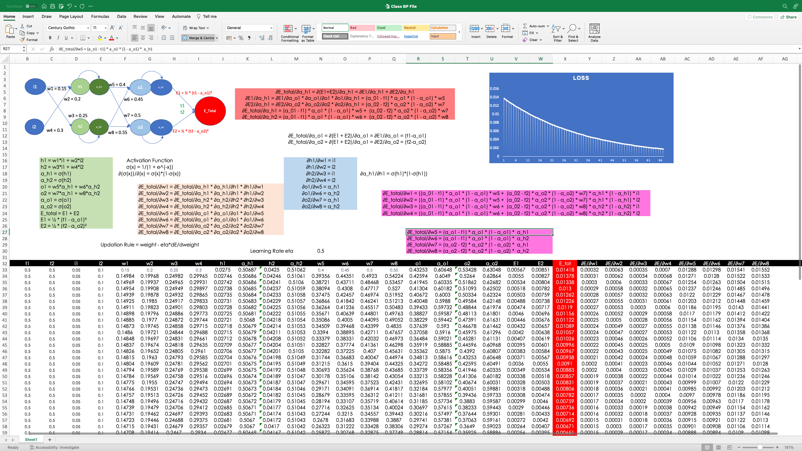
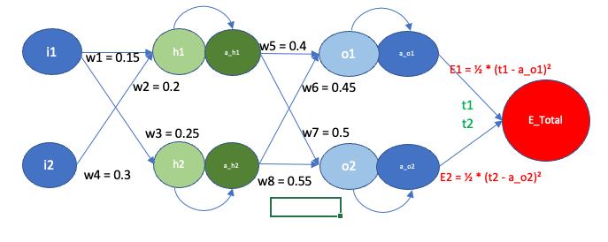
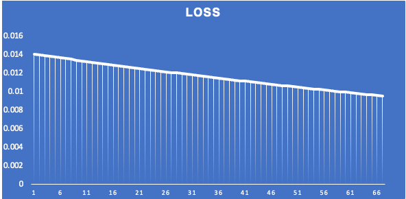
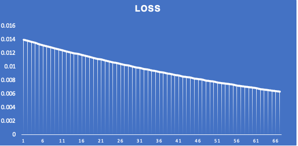
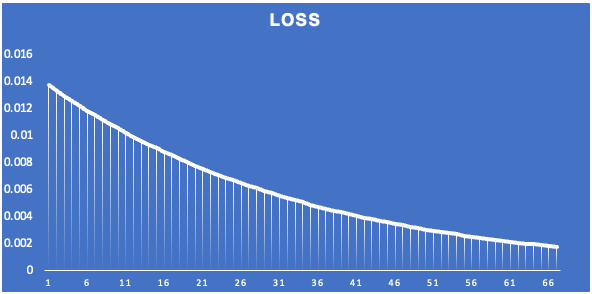
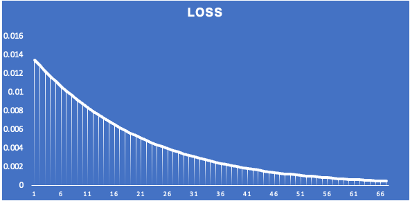
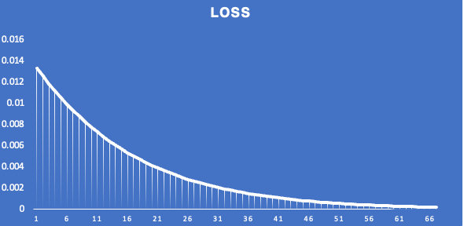
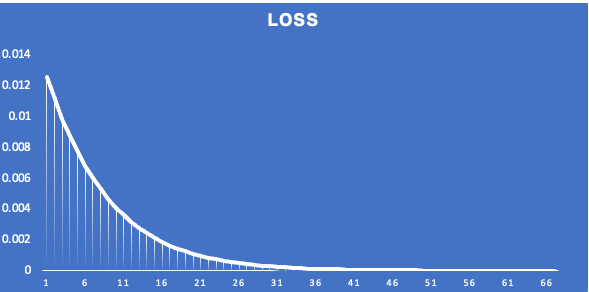

# Part 1 - Excel Task

## Overview

The neural network architecture is as follows:



- **Input Layer:**
  - Two input neurons ($i_{1}$ and $i_{2}$).

- **Hidden Layers:**
  - Two hidden layers with neurons $h_{1}$ and $h_{2}$, where a sigmoid activation function ($σ$) is applied.

- **Output Layer:**
  - Two output neurons ($o_{1}$ and $o_{2}$) with a sigmoid activation function.

- **Loss Function:**
  - Mean squared error loss.

The forward propagation equations are as follows:

- $h_1 = w_1 \cdot i_1 + w_2 \cdot i_2$
- $h_2 = w_3 \cdot i_1 + w_4 \cdot i_2$
- $a_{h_1} = \sigma(h_1)$
- $a_{h_2} = \sigma(h_2)$
- $o_1 = w_5 \cdot a_{h_1} + w_6 \cdot a_{h_2}$
- $o_2 = w_7 \cdot a_{h_1} + w_8 \cdot a_{h_2}$
- $a_{o_1} = \sigma(o_1)$
- $a_{o_2} = \sigma(o_2)$
- $E_{\text{total}} = E_1 + E_2$
- $E_1 = \frac{1}{2} \cdot (t_1 - a_{o_1})^2$
- $E_2 = \frac{1}{2} \cdot (t_2 - a_{o_2})^2$


## Backpropagation Derivation

### Output Layer Gradients:

1. Use the chain rule to compute the gradients of the loss with respect to the weights:

$$\frac{\partial E_{total}}{\partial w5} = \frac{\partial E_{total}}{\partial a_{o1}} \cdot \frac{\partial a_{o1}}{\partial o1} \cdot \frac{\partial o1}{\partial w5}$$
$$\frac{\partial E_{total}}{\partial w6} = \frac{\partial E_{total}}{\partial a_{o1}} \cdot \frac{\partial a_{o1}}{\partial o1} \cdot \frac{\partial o1}{\partial w6}$$
$$\frac{\partial E_{total}}{\partial w7} = \frac{\partial E_{total}}{\partial a_{o2}} \cdot \frac{\partial a_{o2}}{\partial o2} \cdot \frac{\partial o2}{\partial w7}$$
$$\frac{\partial E_{total}}{\partial w8} = \frac{\partial E_{total}}{\partial a_{o2}} \cdot \frac{\partial a_{o2}}{\partial o2} \cdot \frac{\partial o2}{\partial w8}$$

2. Compute the gradient of the loss $E_{total}$ with respect to the outputs of the output layer $a_{o1}$ and $a_{o2}$:

$$\frac{\partial E_{\text{total}}}{\partial a_{o1}} = -(t1 - a_{o1}) = a_{o1} - t1$$
$$\frac{\partial E_{\text{total}}}{\partial a_{o2}} = -(t2 - a_{o2}) = a_{o2} - t2$$


3. Compute the gradients of the outputs with respect to their weighted sums:
$$\frac{\partial a_{o1}}{\partial o1} = a_{o1} \cdot (1 - a_{o1})$$
$$\frac{\partial a_{o2}}{\partial o2} = a_{o2} \cdot (1 - a_{o2})$$

4. Compute the gradients of the weighted sums with respect to the weights:
$$\frac{\partial o1}{\partial w5} = a_{h1}$$
$$\frac{\partial o1}{\partial w6} = a_{h2}$$
$$\frac{\partial o2}{\partial w7} = a_{h1}$$
$$\frac{\partial o2}{\partial w8} = a_{h2}$$


5. Solving equations in step from using from 2, 3, and 4:

$$\frac{\partial E_{total}}{\partial w_5} = (a_{o1} - t_1) \cdot a_{o1} \cdot (1 - a_{o1}) \cdot a_{h1}$$
$$\frac{\partial E_{total}}{\partial w_6} = (a_{o1} - t_1) \cdot a_{o1} \cdot (1 - a_{o1}) \cdot a_{h2}$$
$$\frac{\partial E_{total}}{\partial w_7} = (a_{o2} - t_2) \cdot a_{o2} \cdot (1 - a_{o2}) \cdot a_{h1}$$
$$\frac{\partial E_{total}}{\partial w_8} = (a_{o2} - t_2) \cdot a_{o2} \cdot (1 - a_{o2}) \cdot a_{h2}$$


### Hidden Layers Gradients:

1. Use the chain rule to compute the gradients of the loss with respect to the weights:

$$\frac{\partial E_{total}}{\partial w1} = \frac{\partial E_{total}}{\partial a_{h1}} \cdot \frac{\partial a_{h1}}{\partial h1} \cdot \frac{\partial h1}{\partial w1}$$
$$\frac{\partial E_{total}}{\partial w2} = \frac{\partial E_{total}}{\partial a_{h1}} \cdot \frac{\partial a_{h1}}{\partial h1} \cdot \frac{\partial h1}{\partial w2}$$
$$\frac{\partial E_{total}}{\partial w3} = \frac{\partial E_{total}}{\partial a_{h2}} \cdot \frac{\partial a_{h2}}{\partial h2} \cdot \frac{\partial h2}{\partial w3}$$
$$\frac{\partial E_{total}}{\partial w4} = \frac{\partial E_{total}}{\partial a_{h2}} \cdot \frac{\partial a_{h2}}{\partial h2} \cdot \frac{\partial h2}{\partial w4}$$

2. Compute the gradients of the loss with respect to the outputs of the hidden layer ($a_{h1}$ and $a_{h2}$):

$$\frac{\partial E_{total}}{\partial a_{h1}} = \left(\frac{\partial E_{total}}{\partial o1} \cdot \frac{\partial o1}{\partial a_{h1}}\right) + \left(\frac{\partial E_{total}}{\partial o2} \cdot \frac{\partial o2}{\partial a_{h1}}\right)$$
$$\frac{\partial E_{total}}{\partial a_{h2}} = \left(\frac{\partial E_{total}}{\partial o1} \cdot \frac{\partial o1}{\partial a_{h2}}\right) + \left(\frac{\partial E_{total}}{\partial o2} \cdot \frac{\partial o2}{\partial a_{h2}}\right)$$
$$\frac{\partial E_{total}}{\partial o_1} = (t_1 - a_{o1}) \cdot \frac{\partial}{\partial o_1}(-a_{o1}) + (t_2 - a_{o2}) \cdot \frac{\partial}{\partial o_1}(-a_{o2})$$
$$\frac{\partial E_{total}}{\partial o_2} = (t_1 - a_{o1}) \cdot \frac{\partial}{\partial o_2}(-a_{o1}) + (t_2 - a_{o2}) \cdot \frac{\partial}{\partial o_2}(-a_{o2})$$
$$\frac{\partial E_{total}}{\partial o_1} = (t_1 - a_{o1}) \cdot (-a_{o1} \cdot (1 - a_{o1})) + (t_2 - a_{o2}) \cdot (-a_{o2} \cdot (1 - a_{o2}))$$
$$ \frac{\partial E_{total}}{\partial o_2} = (t_1 - a_{o1}) \cdot (-a_{o1} \cdot (1 - a_{o1})) + (t_2 - a_{o2}) \cdot (-a_{o2} \cdot (1 - a_{o2})) $$
$$ \frac{\partial E_{total}}{\partial a_{h1}} = (t_1 - a_{o1}) \cdot a_{o1} \cdot (1 - a_{o1}) \cdot w_5 + (t_2 - a_{o2}) \cdot a_{o2} \cdot (1 - a_{o2}) \cdot w_7 $$
$$ \frac{\partial E_{total}}{\partial a_{h2}} = (t_1 - a_{o1}) \cdot a_{o1} \cdot (1 - a_{o1}) \cdot w_6 + (t_2 - a_{o2}) \cdot a_{o2} \cdot (1 - a_{o2}) \cdot w_8 $$


3. Compute the gradients of the outputs with respect to their weighted sums (using the sigmoid derivative):
$$\frac{\partial a_{h1}}{\partial h1} = a_{h1} \cdot (1 - a_{h1})$$
$$\frac{\partial a_{h2}}{\partial h2} = a_{h2} \cdot (1 - a_{h2})$$


4. Compute the gradients of the weighted sums with respect to the inputs:
$$\frac{\partial h1}{\partial w1} = i1$$
$$\frac{\partial h1}{\partial w2} = i2$$
$$\frac{\partial h2}{\partial w3} = i1$$
$$\frac{\partial h2}{\partial w4} = i2$$


5. Solving Equations from 1, 2, 3 and 4:
$$\frac{\partial E_{total}}{\partial w_1} = \left((a_{o1} - t_1) \cdot a_{o1} \cdot (1 - a_{o1}) \cdot w_5 + (a_{o2} - t_2) \cdot a_{o2} \cdot (1 - a_{o2}) \cdot w_7\right) \cdot a_{h1} \cdot (1 - a_{h1}) \cdot i_1$$
$$\frac{\partial E_{total}}{\partial w_2} = \left((a_{o1} - t_1) \cdot a_{o1} \cdot (1 - a_{o1}) \cdot w_5 + (a_{o2} - t_2) \cdot a_{o2} \cdot (1 - a_{o2}) \cdot w_7\right) \cdot a_{h1} \cdot (1 - a_{h1}) \cdot i_2$$
$$\frac{\partial E_{total}}{\partial w_3} = \left((a_{o1} - t_1) \cdot a_{o1} \cdot (1 - a_{o1}) \cdot w_6 + (a_{o2} - t_2) \cdot a_{o2} \cdot (1 - a_{o2}) \cdot w_8\right) \cdot a_{h2} \cdot (1 - a_{h2}) \cdot i_1$$
$$\frac{\partial E_{total}}{\partial w_4} = \left((a_{o1} - t_1) \cdot a_{o1} \cdot (1 - a_{o1}) \cdot w_6 + (a_{o2} - t_2) \cdot a_{o2} \cdot (1 - a_{o2}) \cdot w_8\right) \cdot a_{h2} \cdot (1 - a_{h2}) \cdot i_2$$

## Effects of Learing rate changes
### 0.1

### 0.2

### 0.5

### 0.8

### 1.0

### 2.0


# Part 2 - Custom Neural Net

### Network Structure
```
----------------------------------------------------------------
        Layer (type)               Output Shape         Param #
================================================================
            Conv2d-1           [-1, 16, 28, 28]             160
       BatchNorm2d-2           [-1, 16, 28, 28]              32
            Conv2d-3           [-1, 16, 28, 28]           2,320
       BatchNorm2d-4           [-1, 16, 28, 28]              32
            Conv2d-5           [-1, 16, 28, 28]           2,320
       BatchNorm2d-6           [-1, 16, 28, 28]              32
         MaxPool2d-7           [-1, 16, 14, 14]               0
           Dropout-8           [-1, 16, 14, 14]               0
            Conv2d-9           [-1, 16, 14, 14]           2,320
      BatchNorm2d-10           [-1, 16, 14, 14]              32
           Conv2d-11           [-1, 16, 14, 14]           2,320
      BatchNorm2d-12           [-1, 16, 14, 14]              32
           Conv2d-13           [-1, 16, 14, 14]           2,320
      BatchNorm2d-14           [-1, 16, 14, 14]              32
        MaxPool2d-15             [-1, 16, 7, 7]               0
          Dropout-16             [-1, 16, 7, 7]               0
           Conv2d-17             [-1, 16, 7, 7]           2,320
      BatchNorm2d-18             [-1, 16, 7, 7]              32
           Conv2d-19             [-1, 16, 7, 7]           2,320
      BatchNorm2d-20             [-1, 16, 7, 7]              32
           Conv2d-21             [-1, 16, 7, 7]           2,320
      BatchNorm2d-22             [-1, 16, 7, 7]              32
          Dropout-23             [-1, 16, 7, 7]               0
           Linear-24                   [-1, 10]             170
================================================================
Total params: 19,178
Trainable params: 19,178
```
### Some information about Network
- Batch Size: 128
- Used Dropout with 20% at Droput-8 and Dropout-16 and used 15% at Dropout-23
- BatchNorm after each Conv layer.
- Its a long neural net with constant channel size (16) as the fattening of channels increased the parameters drastically. 
- Two Max-pooling to increase RF and the last layers has GAP with FC before Softmax.
- ReLU is the activation function after each Conv2D layer.